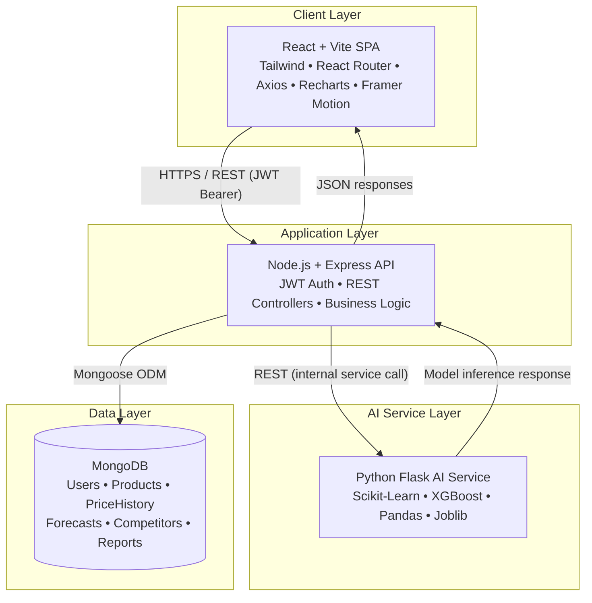
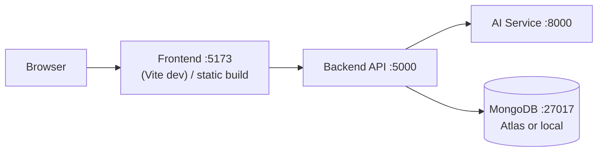

# PriceSmart AI — System Architecture (Phase 1)

## 1. Overview

PriceSmart AI is a 3-tier + AI-microservice system:

1. **Frontend** — React + Vite SPA (dashboard, product management, analytics, reports)
2. **Backend API** — Node.js + Express (auth, CRUD, orchestration, business logic)
3. **AI Service** — Python Flask microservice (price recommendation, demand forecasting)
4. **Database** — MongoDB (single source of truth, shared by backend; AI service reads/writes via backend API, never touches Mongo directly — keeps AI service stateless and swappable)

## 2. High-Level System Architecture Diagram

## 3. Why this shape

- **Backend as orchestrator**: the Node API is the only service that talks to MongoDB. This keeps a single data-access layer, simplifies auth/authorization, and lets the AI service stay a pure "compute" microservice — easy to scale, retrain, or replace independently.
- **AI service is stateless per-request**: it receives product + market data in the request payload (or fetches via an internal callback token), runs inference using pre-trained/joblib-serialized models, and returns predictions. Trained model artifacts (`.pkl` / `.joblib`) live inside the AI service, versioned separately from app code.
- **Frontend never calls the AI service directly** — it always goes through the Express API, which can add caching, auth, rate limiting, and request shaping in one place.

## 4. Deployment Topology (target for hackathon demo)

| Service       | Port | Runtime          |
|---------------|------|-------------------|
| Frontend      | 5173 | Node/Vite dev server (Nginx static in prod) |
| Backend API   | 5000 | Node.js / Express |
| AI Service    | 8000 | Python / Flask (gunicorn in prod) |
| MongoDB       | 27017| MongoDB Community / Atlas |

## 5. Cross-Cutting Concerns (planned, implemented in later phases)

- **Auth**: JWT access tokens (short-lived) issued by backend; stored in memory/HTTP-only cookie on frontend.
- **Validation**: express-validator on backend routes; Pydantic-style schema checks on Flask inputs.
- **Error handling**: centralized Express error middleware; consistent `{ success, message, data }` response envelope.
- **Logging**: morgan (backend), Python logging module (AI service).
- **CORS**: backend whitelists frontend origin only.
- **Environment config**: `.env` files per service, never committed (`.env.example` provided instead).
