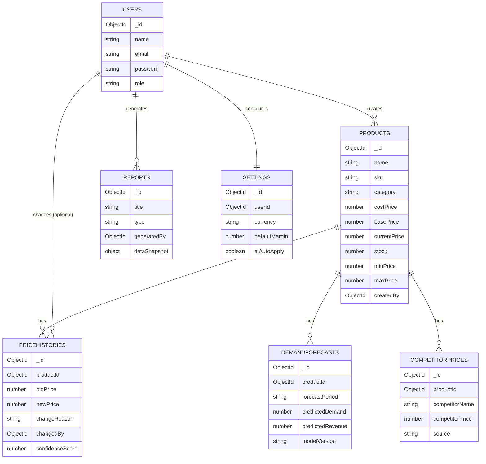
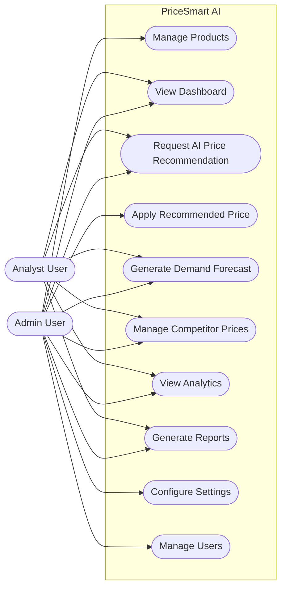
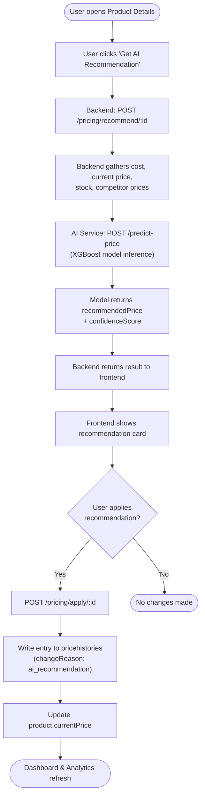
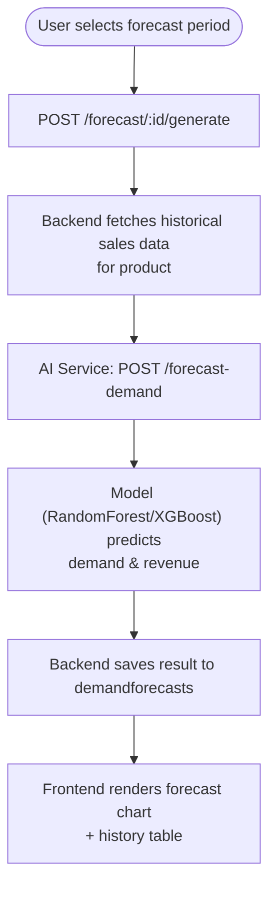
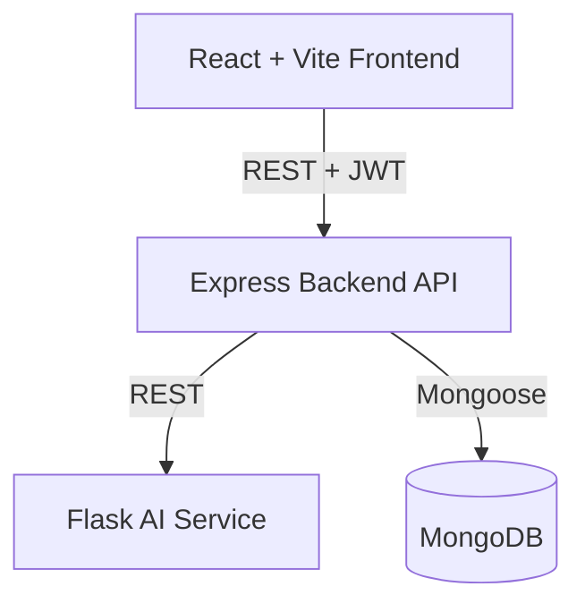

# PriceSmart AI — Diagrams (Phase 1)

All diagrams are written in Mermaid syntax. Paste into any Mermaid live editor
(https://mermaid.live) or view directly in VS Code with the "Markdown Preview Mermaid Support" extension.

## 1. ER Diagram

## 2. Use Case Diagram

## 3. Core Workflow Diagram — AI Price Recommendation

## 4. Core Workflow Diagram — Demand Forecasting

## 5. System Architecture Diagram

(See `01-architecture.md §2` for the full annotated version.)

